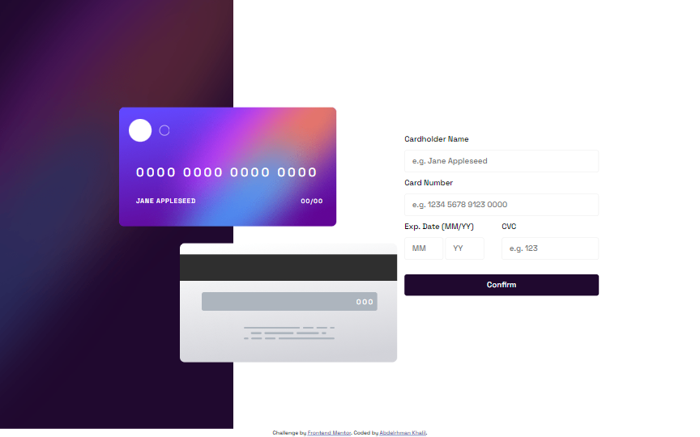
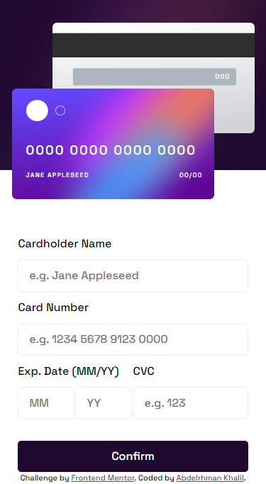

# Frontend Mentor - Interactive card details form solution

This is a solution to the [Interactive card details form challenge on Frontend Mentor](https://www.frontendmentor.io/challenges/interactive-card-details-form-XpS8cKZDWw). Frontend Mentor challenges help you improve your coding skills by building realistic projects.

## Table of contents

- [Overview](#overview)
  - [The challenge](#the-challenge)
  - [Screenshot](#screenshot)
  - [Links](#links)
- [My process](#my-process)
  - [Built with](#built-with)
  - [Continued development](#continued-development)
  - [Useful resources](#useful-resources)
- [Author](#author)
- [Acknowledgments](#acknowledgments)

## Overview

### The challenge

Users should be able to:

- Fill in the form and see the card details update in real-time
- Receive error messages when the form is submitted if:
  - Any input field is empty
  - The card number, expiry date, or CVC fields are in the wrong format
- View the optimal layout depending on their device's screen size
- See hover, active, and focus states for interactive elements on the page

### Screenshot

### Links

- Solution URL: [solution URL here](https://www.frontendmentor.io/solutions/interactivecarddetailsformmain-VK-2L1HzK3)
- Live Site URL: [live site URL here](https://abdelrhmankh.github.io/interactive-card-details-form-main/)

## My process

### Built with

- Semantic HTML5 markup
- CSS custom properties
- Flexbox
- CSS Grid
- Mobile-first workflow

### Continued development

The Best understanding of the Style and how to improve the Css code with better understanding.

## Author

- Website - [AbdelRahman Khalil](https://abdelrhmankh.github.io/abdelrhmankhalil/)
- Frontend Mentor - [@abdelrhmanKh](https://www.frontendmentor.io/profile/abdelrhmanKh)
- LinkedIn - [@Abdelrhman-khalil](https://www.linkedin.com/in/abdelrhman-khalil-ali-9716a0188/)
